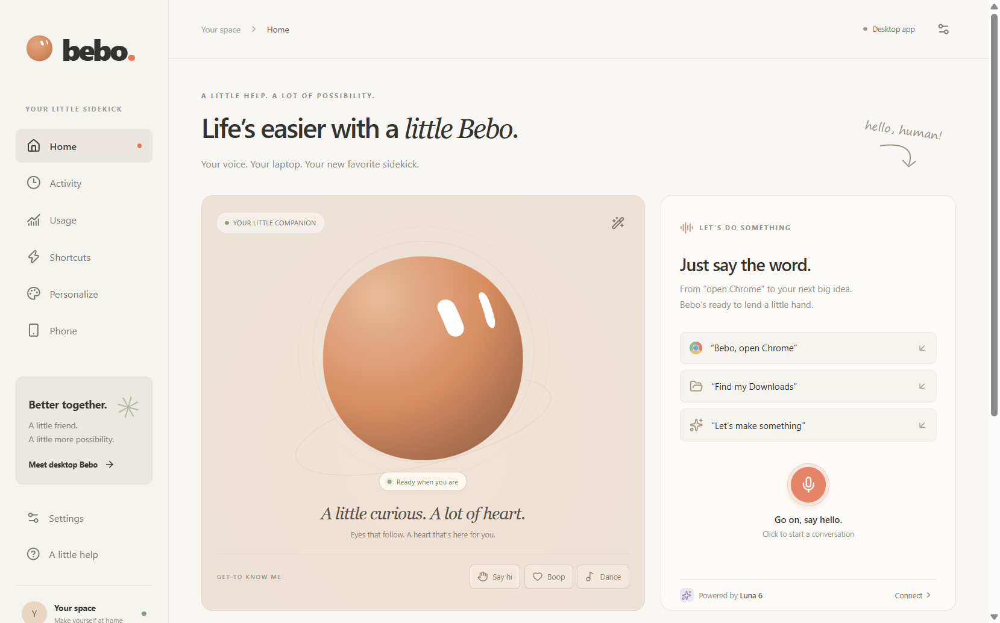
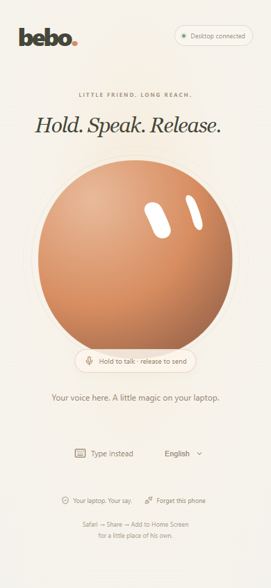
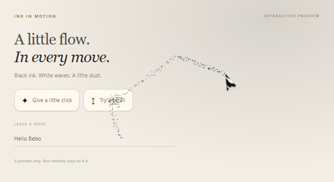
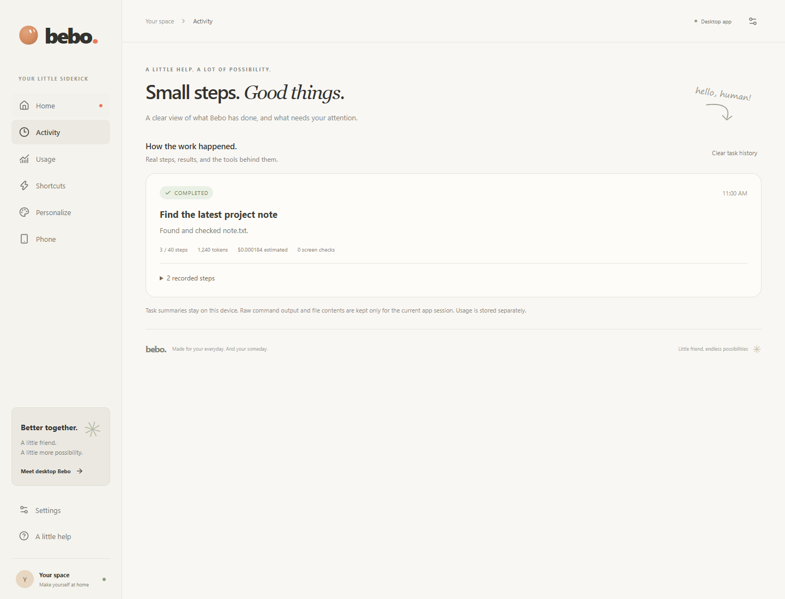

<div align="center">

# bebo.

**A little companion. A more capable desktop.**

A voice-controlled Windows assistant with an expressive avatar, a visible agent cursor, and a phone controller.

[Download for Windows](https://github.com/Akak0o0y/bebo/releases/latest) · [Getting started](#get-started) · [Contribute](CONTRIBUTING.md) · [Report a bug](https://github.com/Akak0o0y/bebo/issues/new/choose)


[](https://github.com/Akak0o0y/bebo/actions/workflows/ci.yml)



</div>

Click Bebo, tell him what you need, and follow the work as it happens. He can inspect apps and windows, work with text files, run PowerShell, and use the screen and mouse when a task needs visual interaction. Questions and approvals appear in the app, beside the floating avatar, or on your paired phone.

Bebo is an early project with public source and contributions welcome. His own code uses the ISC license; the bundled avatar has **separate noncommercial restrictions**. See [Licensing and credits](#licensing-and-credits) before reusing the artwork.

## What Bebo can do

| Feature | How it works |
| --- | --- |
| **Voice and personality** | Click the desktop avatar to dictate. On the phone, hold, speak, and release to send. His expressions reflect listening, thinking, questions, and results. |
| **Desktop work** | Typed tools for files, apps, windows, and PowerShell; fresh screenshots and a visible cursor for visual tasks. |
| **Control from your phone** | Pair once with desktop confirmation, then send requests, answer questions, approve steps, or Stop over a temporary HTTPS link. |
| **A visible presence** | Flowing black-and-white cursor, dust trails, and screen-edge particles with a top-edge Cancel control during computer work. Effects are optional. |
| **Local speech output** | Three bundled Kokoro English voices run on your CPU. Device speech is also available. |
| **Awareness and accounting** | Activity shows steps and observed results. Usage tracks reported tokens and estimated API costs. |
| **Your permissions** | Separate file, terminal, mouse, and keyboard controls, allowed folders, task limits, and cancellation. |

<table>
  <tr>
    <td align="center" width="33%"><br><strong>Hold. Speak. Release.</strong></td>
    <td align="center" width="67%"><br><strong>A little flow in every move.</strong></td>
  </tr>
</table>



*Screenshots show the app and isolated test/preview states. Example task data is from test fixtures; it is not a live-model performance claim. [Image credits](docs/screenshots/README.md).*

## Get started

### Download the Windows app

1. Download **Bebo-1.1.1.exe** from [Releases](https://github.com/Akak0o0y/bebo/releases/latest) and open it. The portable build includes offline voice assets and the phone-link helper.
2. Choose **Connect** and enter an OpenAI API key with access to the configured `gpt-6-luna` model **inside Bebo**. Bebo encrypts the key in your Windows profile and restores it after restart.
3. Type a request or click the microphone. Start with something easy to verify, such as finding a file in an allowed folder.
4. Review requested actions, or choose the permissions you want in **Settings**. Use **Personalize** for the avatar, voice, and screen effects.

AI planning and enhanced transcription use your API account and incur provider charges. Local Kokoro speech output has no voice API charge. Bebo's cost display is an estimate, not an account balance.

### Run from source

Use Windows x64 and Node.js 24; this project was validated with Node 24.11. Google Chrome is used by the browser tests.

```powershell
git clone https://github.com/Akak0o0y/bebo.git
cd bebo
npm ci
npm run desktop
```

The first desktop start verifies/downloads the pinned phone helper and approximately 94 MB of voice assets. The API key is entered through the app, so no `.env` file is required.

For hot reload, use `npm run desktop:dev`. For the visual browser preview, use `npm run dev` and open `http://127.0.0.1:5173`; native desktop tools require Electron.

### Pair your phone

Open **Phone → Create phone link**, scan the QR code, compare the number on both devices, and confirm pairing on the desktop. Hold the phone avatar while talking, then release. The phone can also answer questions and approve steps.

The temporary Cloudflare HTTPS link works from other networks while your laptop is awake, unlocked, online, and running Bebo. Registered phones are remembered, but the temporary URL changes when the tunnel restarts. [Phone setup and privacy details](docs/user-guide.md#phone-controller).

## Control and privacy

- **Stop:** click the top-edge Cancel tab, use the app or phone Stop control, or press **Ctrl + Alt + Escape** on Windows. A completed effect cannot be undone by Stop.
- **Terminal access:** review commands by default. An allowed PowerShell command runs with your Windows account's access; it is not confined to the file-tool folders.
- **Data:** relevant tool results, files, screenshots, and enhanced voice recordings can be sent to OpenAI for a submitted task. English Kokoro output runs locally. Cloudflare relays phone traffic and terminates HTTPS.
- **Limits:** visual targeting uses the primary display. Dragging, remote wake/unlock, background scheduling, and Windows UAC bypass are not implemented.

See the [user guide](docs/user-guide.md) for permission behavior, saved data, recording, and phone access.

## Project status

Version **1.1.1** passed **47 backend tests**, **45 browser cases**, and **9 checks against the packaged Windows app and portable launcher**. Packaged files and native resources were compared with source. Native checks used disposable fixtures and controlled provider responses.

**Live Luna task quality and physical iPhone/Safari behavior remain unverified.** Passing fixtures establishes the tested integration paths, not unrestricted autonomy or a guarantee against future failures.

[Reliability audit](docs/reliability-audit.md) · [Published validation record](docs/validation/v1.1.1.json) · [Architecture](docs/adaptive-work.md)

## Build and contribute

```powershell
npm test
npm run build
npm run test:ui
npm run package:win -- --config.directories.output=release/audited --config.win.artifactName=Bebo-1.1.1.exe
```

We welcome bug reports, accessibility improvements, tests, documentation, and Windows/phone reliability work. Start with [CONTRIBUTING.md](CONTRIBUTING.md), browse [good first issues](https://github.com/Akak0o0y/bebo/labels/good%20first%20issue), or propose a focused change in [Issues](https://github.com/Akak0o0y/bebo/issues).

[Developer guide](docs/development.md) · [Security reporting](SECURITY.md) · [Community guidelines](CODE_OF_CONDUCT.md)

## Licensing and credits

- **Bebo's original code:** [ISC](LICENSE).
- **Avatar:** the OpenAgents integration includes sam70361's Aora / Emotion Ball engine, data, and ball-character visuals. The community license permits attributed noncommercial study/research sharing; the visuals prohibit commercial use. These materials are **not covered by Bebo's ISC grant**. All original [licenses, notices, and provenance](public/vendor/aora/PROVENANCE.md) are retained.
- **Speech:** [Kokoro / ONNX Community](public/vendor/kokoro/PROVENANCE.md), with its Apache-2.0 notices.
- **Phone link:** [Cloudflare cloudflared](public/vendor/cloudflared/PROVENANCE.md), with its Apache-2.0 license.

The animated Windows cursor and dust effects are Bebo's implementation. No Clicky code or assets are bundled.
