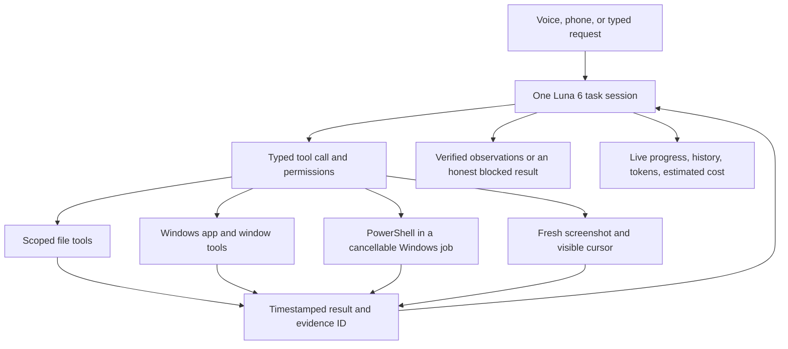

# Bebo adaptive work

Design record, 2026-10-08. The current source audit and release decision are in [reliability-audit.md](reliability-audit.md). Live model performance remains unmeasured; this document does not certify release readiness.

## Objective

Keep Luna 6, the existing voice/phone/avatar controls, and the visible desktop cursor. Replace obligatory screenshot-per-action planning with a typed tool loop. Choose file or app tools for deterministic operations, a local PowerShell runner for scripts, and fresh screenshots for visual work. Do not claim this improves model accuracy until matched live tasks have been measured.

## Runtime

- One task owns execution. Each call has validated arguments, a result ID, timestamps, status, a summary, and recovery guidance. Results and file contents are untrusted data.
- Task state keeps the original request, human clarifications, a small plan, results, failures, and measured API usage. Bound old observations and discard old image payloads; retain result summaries. No automatic task replay after restart.
- UI actions require the newest screenshot reference and its window/display context. Refresh after a UI action, app launch, or shell command. A delayed approval must not replay stale coordinates.
- Completion cites actual successful result IDs. App launches need a subsequent observation. File writes are read back and hashed. Terminal exit status is execution evidence, not a general proof of user intent.
- Stop cancels the model request, the current native operation, and the terminal process tree. Windows permissions are unchanged. A process running under the user's account is not a filesystem sandbox.
- File tools use configured roots and reject traversal, symlink escapes, and secret files. Arbitrary shell access has a separate off/ask/automatic choice; a working directory does not restrict a shell's filesystem access. All approvals show the actual command and directory.
- Preserve the previous screen-only mode for fallback and comparisons. No model substitutions, background surveillance, or permanent indexing of the user's disk.

## Product

Settings exposes adaptive/screen work, terminal permissions, file/app write permissions, folders, and per-task limits. Activity shows live steps and command output, plus saved task summaries. Phone and avatar show the same progress, questions, and approvals. Existing global and top-edge Stop apply to all tools. Usage continues accounting for every model response.

## Acceptance

Use isolated temporary folders and mocked provider replies for deterministic tests. Exercise real Windows terminal output, failure, timeout and cancellation of a spawned child. Exercise an Electron request through the production bridge, file/terminal/screen handoffs, approval replay rejection, completion evidence, saved history, and the existing stop overlay. Run TypeScript/build and relevant UI regressions. Provider mocks establish integration correctness only.

Matched live evaluation (requires an API connection in Bebo): open an installed app, find newest PDF, read a text file, create a note, diagnose a missing file, recover from a command failure, cancel a running command, and clarify an ambiguous target. Run both modes on the same fixture state. Record independently verified task completion, wall time, API requests/tokens/estimated USD, screenshots, retries and user interventions. Report cost per verified completion, including failed attempts. Do not fabricate a speed/cost percentage from mocked runs.

## Historical evidence: initial 1.1.0 implementation

- TypeScript and production build passed.
- 37 Node tests passed, including real Windows window/app discovery, Unicode terminal output, native nonzero exit propagation, command timeout, and cancellation before a child could write its delayed marker.
- 40 browser cases passed across the full run and focused rerun. The two new UI fixture failures were corrected: one expected punctuation did not match the displayed copy; the other mock returned the same mutated object instead of cloning like Electron IPC. Existing avatar, phone hold/release, cursor, approvals, speech and usage checks passed.
- The native adaptive test passed through the production Electron bridge: approval precedes writing; content is read back; terminal command/output appears in Activity; the planner switches to a screen observation; questions continue the same task; top-edge Cancel stops the terminal; usage records every provider attempt; summaries and permissions survive restart.
- Screen-only border/cancellation regression passed on rerun. Its five-second polling assumption was widened to fifteen seconds for native screen startup, and outstanding test promises now surface the original assertion instead of an unhandled close error.
- Packaged Bebo 1.1.0 successfully as `release/adaptive/Bebo-Adaptive.exe`. All 53 packaged application files match their source; the Windows bridge and terminal helper are present and verified. Adaptive work, screen-only border/cancellation, and usage/transcription integration tests also passed against `release/adaptive/win-unpacked/Bebo.exe`.

All model decisions in these checks are local fixtures. No paid inference, real voice recognition quality evaluation, or matched performance benchmark was run. Native app launching is implemented using IDs from Windows Start Apps; only app discovery was exercised in the read-only Windows test. UI targeting still uses the primary display; app metadata does not provide a full accessibility tree or browser DOM.
